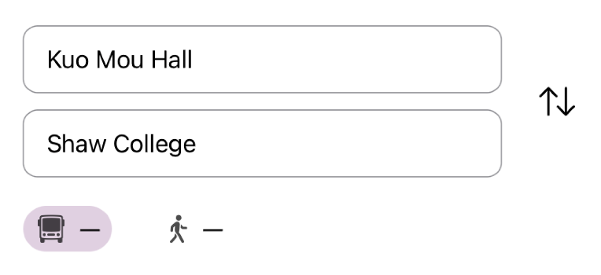

# View Model

## 1 UserPoint.swift

Indicate the location of current location.

```swift
@ObservedObject var locationGetter: LocationGetterModel
@Binding var offset: Offset
@Binding var scale: CGFloat
```

## 2 MapView.swift

Show a background map:

```swift
Image("cuhk-campus-map")
```

Show plans in map:

```swift
@Binding var plans: [Plan]
@Binding var planIndex: Int
```

Show current location: <i>(UserPoint.swift)</i>

```swift
@ObservedObject var locationGetter: LocationGetterModel
```

Hold gesture:

```swift
@State var lastOffset = Offset(x: 0, y: 0)
@State var offset = Offset(x: 0, y: 0)
@State var lastScale = initialZoom
@State var scale = initialZoom
```

The offset of MapView.swift is controlled by height of <i>PlansView.swift</i> as follow:

```swift
.offset(y: lastHeight >= UIScreen.main.bounds.height * 0.4 ? -lastHeight : 0)
```

## 3 PlansView.swift

Show plans in sheets:

```swift
@Binding var plans: [Plan]
@Binding var planIndex: Int
```

If plans.isEmpty, `NoPlanView(lastHeight: $lastHeight, height: $height)` ; else, `PlanView(plan: plans[planIndex], lastHeight: $lastHeight, height: $height)`.

The height of itself:

```swift
@Binding var lastHeight: CGFloat
@Binding var height: CGFloat
```

## 4 SearchView.swift

Switched between SearchArea and SearchList.

### 4.1 SearchArea

Positioned at top of screen, ignoring safe area. 

For doing RP (route planning), once it appears or 􀄬 is clicked.



Input for RP:

```swift
@Binding var startLoc: Location?
@Binding var endLoc: Location?
@State var routes: [Route]
```

Output:

```swift
@Binding var plans: [Plan]
@Binding var planIndex: Int
```

Show SearchList:

```swift
@Binding var showStartList: Bool
@Binding var showEndList: Bool
```

Other data:

```swift
@State var mode: TransMode // .bus ot .foot
@State var angle = 0.0 // animation for 􀄬
```

### 4.2 SearchList

A page occupying whole screen. 

For searching and choosing a location as starting point or ending point.


Search box:

```swift
@State var placeholder: String // "From" or "To"
@State var keyword: String // type to search for location
```

Location List:

```swift
@ObservedObject var locationGetter: LocationGetterModel // for current location
@State var locations: [Location]
```

Chosen Location:

```swift
@Binding var location: Location?
```

Show itself or not:

```swift
@Binding var showList: Bool
```


